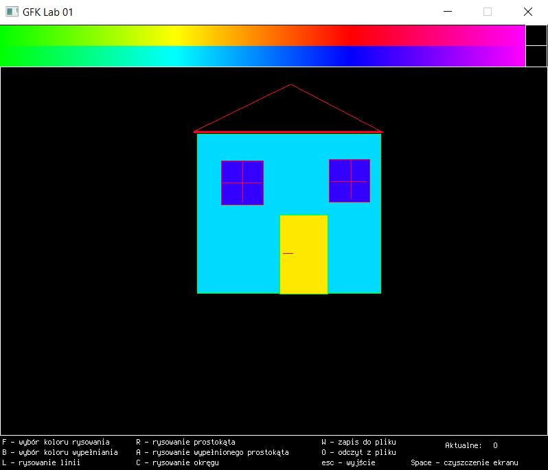
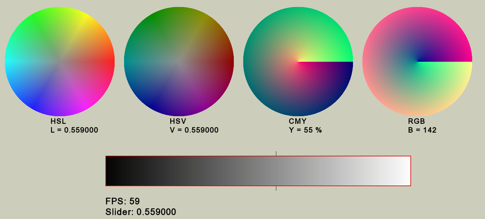
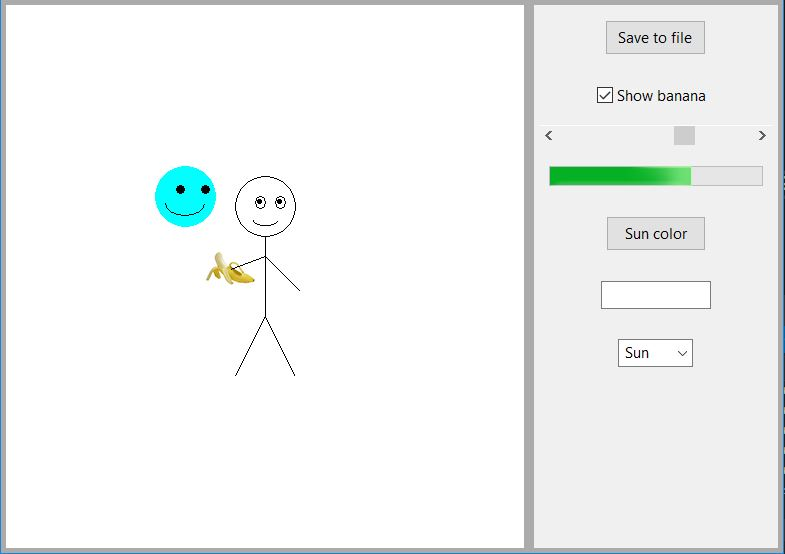
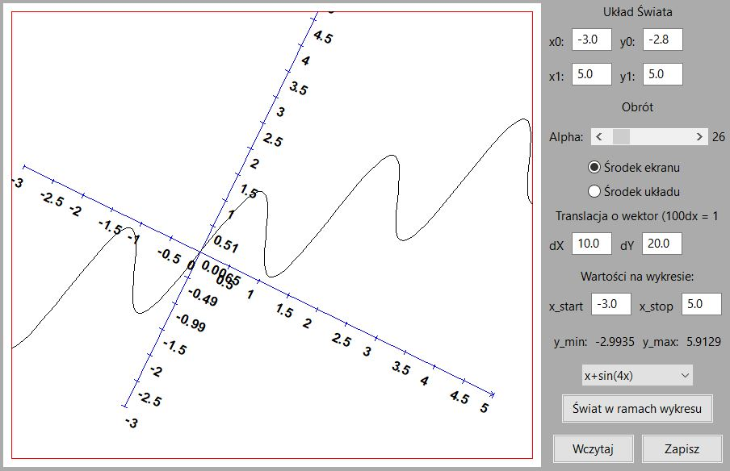
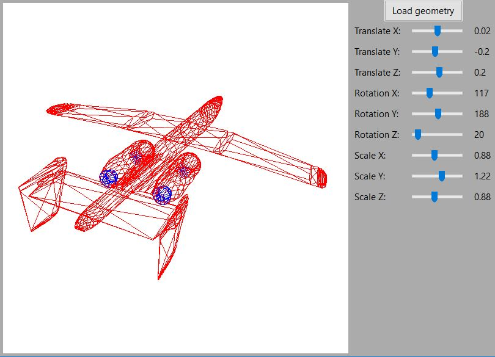

# computer-graphics
Exercises and personal projects using <b>SFML/wxWidgets</b> libraries. Entirely written in <b>C++</b>.

##### Project on course credit will appear soon!

### Programs samples:

##### LAB 01

##### LAB 02

##### LAB 03

##### LAB 04

##### LAB 05

