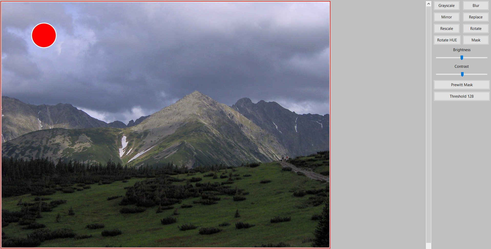
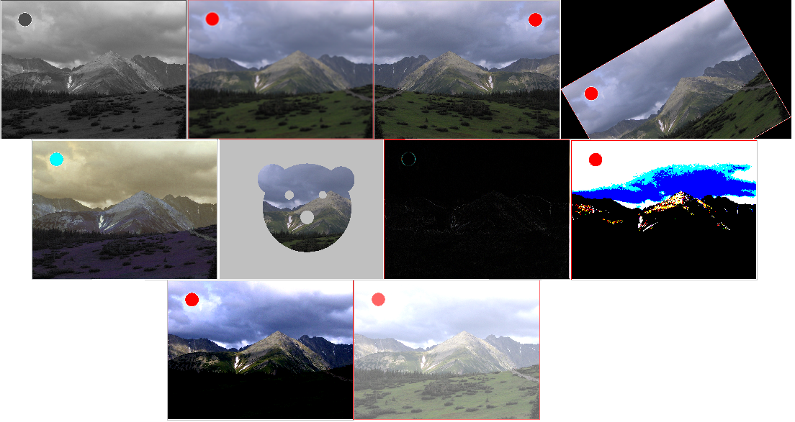
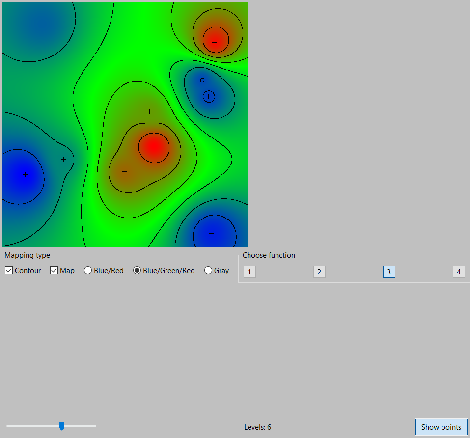

# computer-graphics
Exercises and personal projects using <b>SFML/wxWidgets</b> libraries. Entirely written in <b>C++</b>.

### Project on course credit is <a href="https://github.com/serinline/4d-functions-project">HERE</a>

### Programs samples:

##### LAB 01

##### LAB 02

##### LAB 03

##### LAB 04

##### LAB 05

##### LAB 06

 

##### LAB 07

